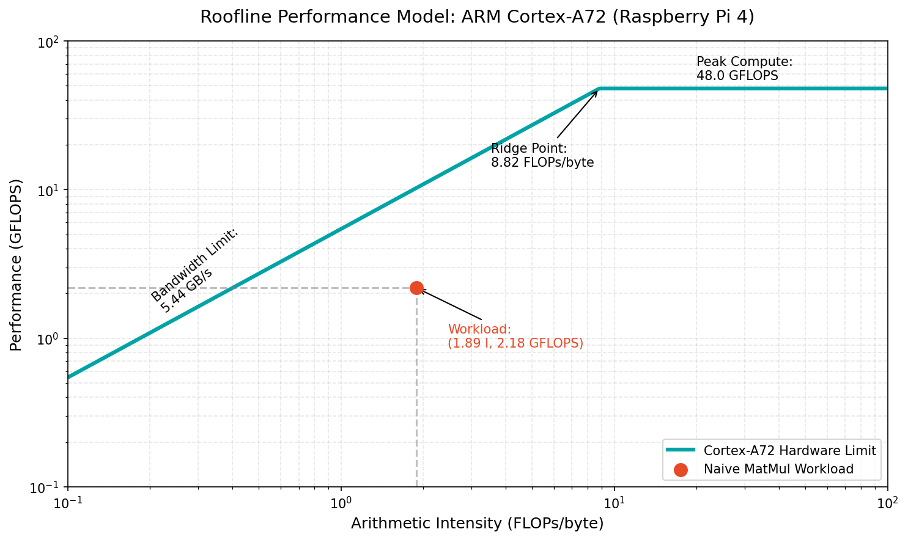
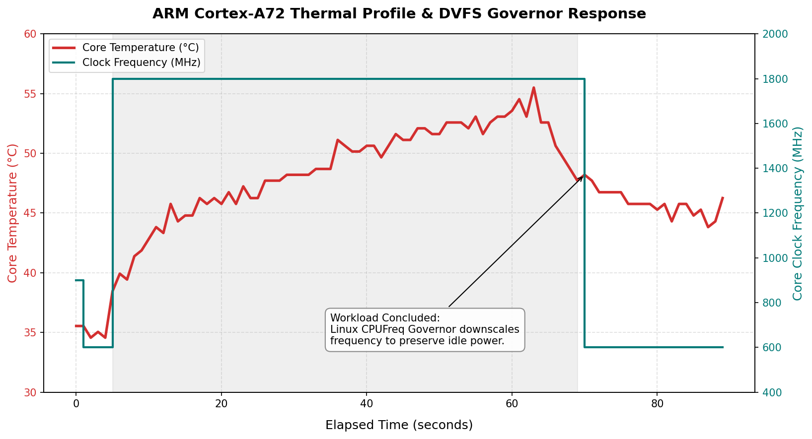

# ARM Cortex-A72 Microarchitecture Profiling & Analysis
*Empirical hardware-software co-design, cache telemetry, and DVFS state analysis on the Broadcom BCM2711 (Raspberry Pi 4 @ 1.8 GHz).*

## Project Overview
This repository contains a suite of low-level C microbenchmarks and Python telemetry tools designed to map the physical bounds of the ARM Cortex-A72 core (ARMv8-A). The project constructs an empirical **Roofline Performance Model** to analyze workload bottlenecks and investigates the SoC's **Dynamic Voltage and Frequency Scaling (DVFS)** behavior under multi-threaded stress.

---

## Part 1: Empirical Roofline Model & Memory Hierarchy Analysis

### 1. Hardware Ceilings (1.8 GHz Operating Frequency)
To evaluate the silicon, theoretical and physical hardware limits were established:
* **Compute Ceiling ($P_{\text{peak}}$):** Calculated based on the Cortex-A72's dual-issue NEON SIMD pipelines (4 floats $\times$ 2 ops/cycle $\times$ 4 cores $\times$ 1.8 GHz) yielding **57.6 GFLOPS**.
* **Memory Bandwidth ($B_{\text{peak}}$):** Saturated the LPDDR4 memory controller via multi-threaded block transfers to measure a physical limit of **5.44 GB/s**.
* **The Ridge Point:** $\frac{57.6}{5.44} =$ **$10.59 \text{ FLOPs/byte}$**. Workloads falling below this intensity are fundamentally memory-bound.

### 2. Workload Profiling & Optimization Trajectory
A standard $1024 \times 1024$ single-precision matrix multiplication was profiled using Linux `perf` PMU counters to track L2 cache misses. Successive optimization attempts revealed critical microarchitectural bottlenecks.

| Iteration | Execution Time | Arithmetic Intensity | GFLOPS | Diagnosis / Hardware Bottleneck |
| :--- | :--- | :--- | :--- | :--- |
| **Naive C (Baseline)** | 0.986 s | 1.89 FLOPs/byte | 2.18 | **Memory-Bound.** Standard linear execution starving the compute units. |
| **NEON + 64x64 Tile** | 0.879 s | 0.387 FLOPs/byte | 2.44 | **L1 Cache Thrashing.** The 48 KB working set exceeded the 32 KB physical L1 D-Cache capacity, causing massive eviction penalties. |
| **NEON + 32x32 Tile** | 1.197 s | 0.315 FLOPs/byte | 1.79 | **D-TLB Thrashing.** While fitting the L1 cache, the 32-row jumps saturated the 32-entry Level-1 Data Translation Lookaside Buffer, triggering page walk stalls. |

**Optimization Conclusion:** Achieving maximum compute throughput on the Cortex-A72 requires more than intrinsic vectorization and naive blocking. It demands multi-level cache tiling and explicit memory packing (copying blocks into contiguous memory) to satisfy the D-TLB constraints.

---

## Part 2: DVFS & Thermal Governor Telemetry

### 1. Methodology
Developed a lightweight Python polling daemon (`thermal_logger.py`) to bypass standard system monitors and read directly from the Linux `sysfs` hardware registers, capturing P-State transitions and core temperatures at 1-second intervals. The SoC was subjected to a 60-second, 4-thread `sysbench` utilization test.

### 2. Telemetry Analysis
* **The Step-Response:** The SoC initialized at an idle baseline of **34.56°C** utilizing a low-power P-State of **600 MHz**. At $T=5.0\text{s}$, the workload introduction triggered an instantaneous step-response from the Linux `cpufreq` governor, snapping the clock to **1800 MHz**.
* **Thermal Curve:** The silicon demonstrated a stable exponential thermal curve over the 60-second load window, peaking safely at **55.50°C** without external cooling.
* **Governor Downscaling:** At $T=70.0\text{s}$, immediately following thread completion, the frequency dropped back to **600 MHz**. 
* **Conclusion:** The abrupt frequency scaling was **not** an instance of structural hardware thermal throttling (which is architecturally capped between 80°C–85°C on the BCM2711). Telemetry confirms it was a proactive P-State downscale by the Linux governor to preserve power efficiency the exact moment CPU utilization dropped.

---

## Toolchain & Execution
* **Target Architecture:** AArch64 (ARMv8-A)
* **Compiler:** `gcc -O3 -mcpu=cortex-a72 -ftree-vectorize`
* **Telemetry:** Linux `perf` (PMU access), `sysbench`, `sysfs` direct polling.
